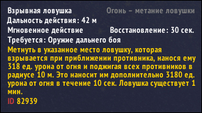
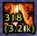

#SpellDamage
It is a World Of Warcraft addon that displays spell's damage, heal and absorb on the action bar.

#Restrictions
Works only in WOW **6.2** version and only if **Display Point as Average** setting is **on**.  
Works only in next locales:
  
* English (enUS, enGB),  
* Russian (ruRU),
* German (deDE),
* Spanish (esES),
* French (frFR),
* Italian (itIT),
* Brazilian Portuguese (ptBR),
* Simplified Chinese (zhCN).

This addon doesn't works in Korean (koKR), Latin American Spanish (esMX) and Traditional Chinese (zhTW) locales. Sorry.

Is russian locale additionally displays items's (potions, food & drinks, bandages, ...) data on action bar.

#Installation
Just copy **SpellDamage** folder to **World of Warcraft\\Interface\\AddOns\\**.

#How does is works?!
This addon just take some digits from spell's description and displays it.

Description:  

Action bar display:  

#Chat commands
>**/sd** или **/spelldamage** - show commands list  
>**/sd status** - show current settings  
>**/sd items** - enable/disable displays data on items (works only in russian locale)  
>**/sd errors** - enable/disable errors printing in chat  
>**/sd help** -  show help for macros usage  
>**/sd version** - show current addon version

#Usage with macros
This addon supports data displaying on a macros. For this just add next line to macros code
>\#sd *id*
  
where *id* - spell's id, which data you want to see. For example, **\#sd 56641** displays  data of "Steady Shot" spell on your macros on the action bar.

#Have a question?
Write - **demonist616@gmail.com**