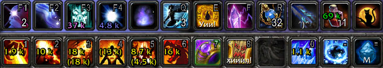
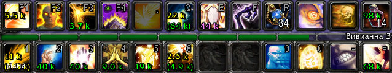

#SpellDamage
It is a World Of Warcraft addon that displays spell's damage, heal or absorb on the action bar.  
Also displays some potions.

#Restrictions
Works only in WOW **6.2** version and only if **Display Point as Average** setting is **on**.   
Supports user interfaces: standard, ElvUi, Dominos.

This addon doesn't works in Latin American Spanish (esMX) locale. Sorry.

#Installation
Just copy **SpellDamage** folder to **World of Warcraft\\Interface\\AddOns\\**.

#How does is works?!
This addon just take some numbers from spell's description and displays it.

Unlike **DrDamage** this addon don't calculate values\* and unlike **MyDamage**, values is absolute and independent from the target\*\*.  
_\*Actually, in some cases this addon calculate values if it needed. For example, if spell always critical hits.  
\**Actually, values may depends from the target. For example, 'Breath of Fire' makes also DOT damage if target has 'Dizzying Haze' debuff._

#Slash commands
>**/sd** or **/spelldamage** - show commands list  
>**/sd status** - show current settings  
>**/sd items** - enable/disable displays data on items 
>**/sd errors** - enable/disable errors printing in chat  
>**/sd macroshelp** -  show help for macros usage  
>**/sd version** - show current addon version

#Usage with macros
This addon supports data displaying on a macros. For this just add to macros code `\#sd *id*`, where *id* - spell's id, which data you want to see. For example, **\#sd 56641** displays  data of "Steady Shot" spell on your macros on the action bar.

#Screenshots

More in [screenshots folder](https://github.com/Demonist/SpellDamage/tree/master/screenshots/).

#Dev mode
Since 0.9.2.3 version was added *dev mode* option.  
It may useful only for developers and testers. This mode is activated by command **/sd dev**.  
In this mode after reloading the UI, this addon check all spells for all classes. If has a error - it will be showed like Lua error. So *dev mode* require *Show Lua errors* option is enable.

Also strongly recommend to use the [BugSack](http://www.curse.com/addons/wow/bugsack) addon in *dev mode*.

#Have a question?
Write - **demonist616@gmail.com**